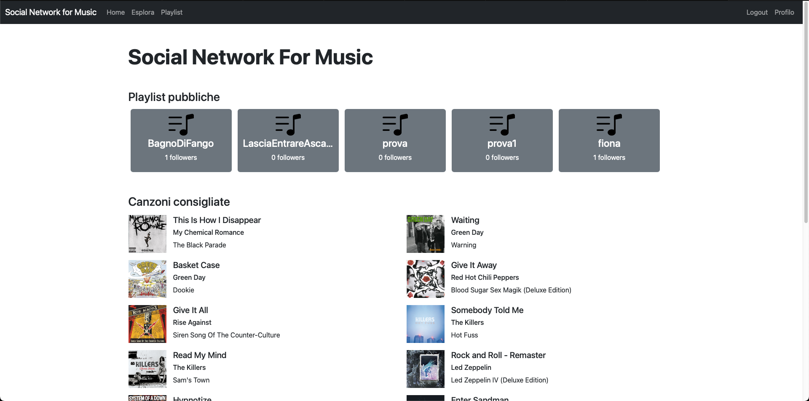
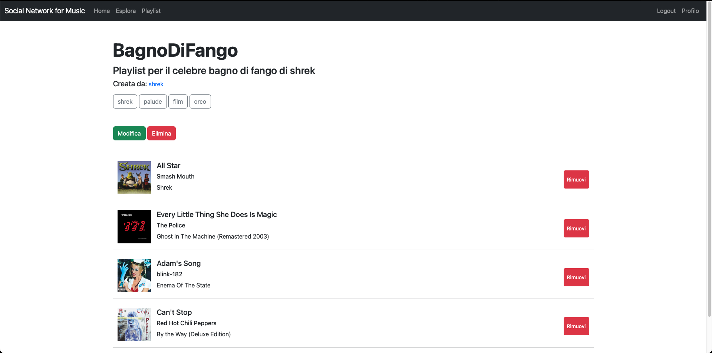
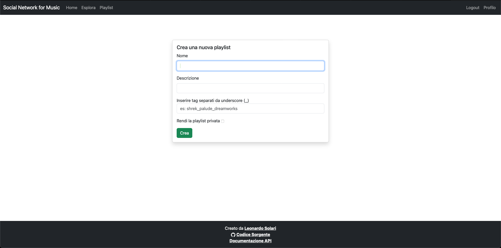
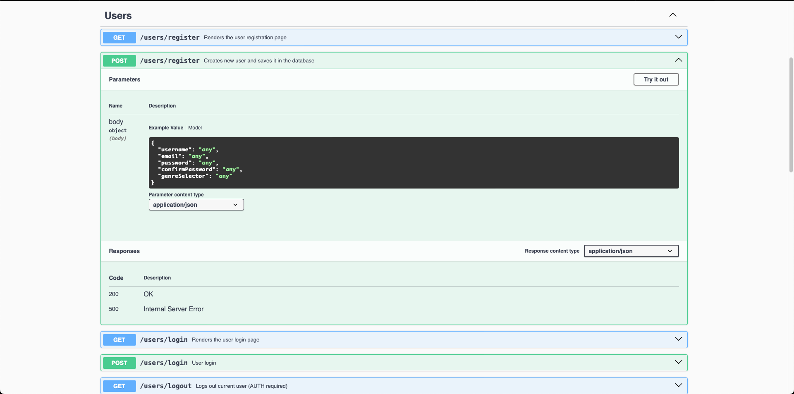

# Relazione

Relazione del progetto "Social Network for Music" per l'esame di Tecnologie e Linguaggi per il Web.

Realizzato da Leonardo Solari, n. matricola 941895

## Introduzione
Questo progetto ha lo scopo di realizzare un'applicazione web full stack per la gestione di playlist musicali. Le funzionalità principali che l'applicazione mette a disposizione dell'utente sono:

* **Gestione degli utenti**: possibilità di creare un profilo utente, visualizzarlo, modificarlo ed eliminarlo
* **Gestione delle playlist**: possibilità di creare delle playlist, visualizzarle, modificarne le impostazioni ed eliminarle
* **Integrazione con le API di Spotify**: possibilità di effettuare ricerche di album, artisti e brani nel catalogo di Spotify grazie alle API ufficiali e di aggiungere tracce alle playlist dell'applicazione


## Installazione
 
Una versione live dell'applicazione sempre aggiornata all'ultima versione disponibile si può trovare all'indirizzo all'indirizzo [snm.leonardosolari.com](snm.leonardosolari.com)

Il codice sorgente dell'applicazione è reperibile in una repo [Github](https://github.com/leonardosolari/social-network-for-music)

### Installazione locale

Per eseguire in locale l'applicazione è sufficiente eseguire la seguente procedura: 

* Clonare localmente la repository del progetto:
	* `git clone https://github.com/leonardosolari/social-network-for-music && cd social-network-for-music`

* Installare i moduli necessari al funzionamento:
	* `npm install`

* Creare il file `.env` contenente le variabili d'ambiente necessarie al funzionamento dell'applicazione
	* Il file deve contenere le seguenti variabili
		* `SPOTIFY_CLIENT_ID`: id per utilizzare le API di Spotify
		* `SPOTIFY_CLIENT_SECRET`: segreto per utilizzare le API di spotify
		* `MONGODB_URI`: indirizzo del database MongoDB
		* `SECRET`: segreto utilizzato per l'hashing delle password
	* Nella repo del progetto è presente un file `.env.example` che illustra la struttura corretta
	* Nel caso in cui il file `.env` non fosse trovato dall'applicazione questa utilizzerà i valori di default per il funzionamento in locale
* Avviare l'applicazione:
	* `npm run start`
* Il sito sarà raggiungibile all'indirizzo [http://localhost:3000](http://localhost:3000)

## Stack tecnologico
Per la realizzazione del progetto sono state utilizzate le seguenti tecnologie:

* `Express` come framework per il backend
* `EJS` come motore di rendering per il frontend
* `MongoDB` come database

Sono inoltre state utilizzate le seguenti librerie o utilità: 

* `axios` per effettuare richieste HTTP
* `passport` per gestire l'hashing delle password, l'autenticazione degli utenti e la registrazione nel database
* `mongoose` per la comunicazione con il database
* `validator` per la validazione dei dati da inserire nel database
* `connect-flash` per la visualizzazione di messaggi flash
* `swagger` per generare la documentazione delle API dell'applicazione
* `nodemon` per semplificare il processo di sviluppo

## Struttura del codice
Nella repository del progetto è possibile trovare le seguenti cartelle e file degni di nota: 

* `config` contenente file di configurazione per il corretto funzionamento di alcune componenti dell'applicazione come per esempio il database e passport
* `controllers` contenente i controller che gestiscono la logica dell'applicazione. I controller sono divisi in più file a seconda della parte di applicazione che gestiscono
* `docs` contenente i file per la configurazione e il corretto funzionamento di swagger
* `middleware` contenente tutti i middleware utilizzati
* `models` contenente gli schemi per le collezioni di dati da inserire nel database
* `public` contenente file statici come fogli di stile, immagini e script utilizzati per gestire alcune pagine
* `routes` contenente i file per la logica di routing dell'applicazione
* `utils` contenente alcune funzioni utili come il fetching di dati da spotify ed il loro parsing
* `views` contenente tutti i file utilizzati dal motore di rendering EJS per generare la UI dell'applicazione
	* `partials` contenente porzioni di codice riutilizzabili

* `app.js` che consiste nell'entry point dell'applicazione
* `Dockerfile` utilizzato da una action github che automatizza la build di un'immagine docker dell'applicazione ogni volta che viene eseguito un push


## Scelte implementative


### Autenticazione e autorizzazione
La fase di registrazione e autenticazione all'applicazione è stata realizzata utilizzando [passport](https://passportjs.org). Passport JS è una libreria Node.js che fornisce un middleware per l'autenticazione. Questa libreria supporta diversi tipi di autenticazione, tra cui OAuth, OpenID e Local Strategy.
In particolare ho utilizzato l'ultima che permette di autenticare gli utenti mediante un username e una password. Il controllo e mantenimento dell'autenticazione avviene utilizzando le browser session. Quando un utente effettua il login, Passport crea una sessione del browser e memorizza l'ID della sessione nei cookies. I dati relativi alle sessioni vengono anche salvati nel databse. Ogni sessione è impostata per scadere dopo 60 minuti, dopo i quali l'utente dovrà riautenticarsi.
Ho inoltre utilizzato il plugin `passport-local-mongoose` che semplifica l'integrazione tra passport-local e il database, gestendo automaticamente l'hashing delle password e l'inserimento di un nuovo utente nel database.

```js
// /models/User.js
// plugin for passport-local-mongoose 
UserSchema.plugin(passportLocalMongoose); 

// /config/passport.js
module.exports = function (passport) {
    passport.use(
        new LocalStrategy(User.authenticate())
    )
}

passport.serializeUser(User.serializeUser()); 
passport.deserializeUser(User.deserializeUser());

// app.js
//setup session
const secret = process.env.SECRET || 'segretosupersegretissimo';
app.use(
  session({
    secret: secret,
    resave: false,
    saveUninitialized: false,
    store: MongoStore.create({
      mongoUrl: process.env.MONGODB_URI || 'mongodb://127.0.0.1:27017/snm'
     }),
    cookie: {
      httpOnly: true,
      // secure: true,
      expires: Date.now() + 1000 * 60 * 60, //1 hour
      maxAge: 1000 * 60 * 60 //1 hour
  }
  })
);

require("./config/passport")(passport);

app.use(passport.initialize());
app.use(passport.session());


```

#### Middleware
Sono stati creati dei middleware ad hoc per gestire le autorizzazioni riguardo ad alcune azioni all'interno dell'applicazione.
Il middleware `ensureAuth` serve per proteggere gli endpoint ed assicurarsi che l'accesso a questi possa avvenire solamente da parte di un utente autenticato.

```js
module.exports.ensureAuth = function (req, res, next) {
      if (!req.isAuthenticated()) {
        res.status(403)
        req.session.returnTo = req.originalUrl
        req.flash('error', 'Effettua il login')
        return res.redirect("/users/login");
      } 

      next();
    }
```

Il middleware `ensureOwner` protegge le azioni di modifica e cancellazione dei profili assicurandosi che le richieste a queste avvengano solo da parte del legittimo proprietario del profilo.

```js
module.exports.ensureOwner = function(req, res, next) {
    if (req.user.id !== req.params.id) {
        res.status(403)
        req.flash('error', 'Operazione non consentita')
        return res.redirect('/')
    }
    next()
}
```


Il middleware `isAuthor` si assicura che modifica, cancellazione e aggiunta e rimozione di canzoni dalle playlist possano avvenire solamente da parte dell'autore. 

```js
module.exports.isAuthor = async function(req, res, next) {
    const playlist = await Playlist.findById(req.params.id)
    if (playlist.author != req.user.id) {
        res.status(403)
        req.flash('error', 'Operazione non consentita')
        return res.redirect('/')
    }
    next()
}
```

### Gestione delle pagine
Per quanto riguarda il lato frontend l'applicazione utilizza EJS come motore di templating. Il punto di forza di EJS è che permette il rendering lato server di pagine HTML dinamiche utilizzando javascript, semplificando il processo di creazione dell'applicazione e permettendo di personalizzare l'interfaccia utente in base alla necessità. EJS permette l'utilizzo dei partials, ovvero parti di codice che possono essere definite una volta sola e riutilizzate in più pagine.


**artistCard.ejs**

```ejs
<div class="col-sm-1 me-3 mt-2 d-flex mx-auto">
    <div class="card border-0 text-center">
        <a href="/search/artist/<%= artist.id %>">" class="card-img-top rounded-circle" alt="..." style="width: 100%;"></a>
        <div class="card-body mt-3">
            <p class="card-title"><%= artist.name%></>
        </div>
    </div>
</div>
``` 

```ejs
<%- include('../partials/artistCard', {artist: artist})%>
```

### Chiamate alle API di Spotify
Le chiamate alle API di Spotify sono gestite all'interno del file `/utils/spotifyFetch.js`.
Per poter effettuare una richiesta alle API di spotify è necessario possedere un token di accesso, che viene generato dalla seguente funzione: 

```js
const generateSpotifyToken = async function() {
    const credentials = `${clientId}:${clientSecret}`;
    const encodedCredentials = Buffer.from(credentials).toString('base64');
  
    const response = await axios({
      method: 'POST',
      url: 'https://accounts.spotify.com/api/token',
      headers: {
        'Content-Type': 'application/x-www-form-urlencoded',
        'Authorization': `Basic ${encodedCredentials}`
      },
      data: 'grant_type=client_credentials'
    });
  
    const token = response.data.access_token;
    return token;
}
```
e successivamente utilizzato dal seguente wrapper che permette di effettuare richieste alle utilizzando il token creato

```js
const fetchWithToken = async function(url, options = {}) {
    const token = await generateSpotifyToken()

    const config = {
        headers: {
            Authorization: 'Bearer ' + token,
        },
        params: options
    }

    try {
        const response = await axios.get(url, config)
        return response.data

    } catch (error) {
        console.log(error)
    }
}
```
Con questa implementazione per ogni richiesta alle API di Spotify viene generato un nuovo token, scelta non ottimale ma accettabile visto che si tratta di un'applicazione di piccola scala e con pochi utenti.


I dati ottenuti dalle API di spotify contengono spesso più dati di quelli che sono necessari, e quindi vengono filtrati dalle funzioni presenti nel file `/utils/spotifyResponseParser.js`, che restituiscono un oggetto con solo i campi desiderati.

```js
module.exports.filterTrackFields = (item) => {
    const duration = new Date(item.duration_ms)
    const durationString = duration.getMinutes() + ':' + ('0' + duration.getSeconds()).slice(-2)
    const release_date = new Date(item.album.release_date)
    return {
        name: item.name,
        id: item.id,
        duration: durationString,
        explicit: item.explicit,
        artists: item.artists.map(artist => ({ name: artist.name, id: artist.id })),
        album: { name: item.album.name, id: item.album.id, release_date: release_date.getFullYear() },
        image: item.album.images[0].url
    };
}
```

### Database
La connessione al database è gestita all'interno del file `/config/database.js` tramite `mongoose`. Allo startup dell'applicazione viene effettuata un'unica connessione al database. 

```js
const connectDB = async () => {
    try {
      const conn = await mongoose.connect(databaseUri);
  
      console.log(`MongoDB Connected: ${conn.connection.host}`);
    } catch (err) {
      console.error(err);
      process.exit(1);
    }
  };
```

All'interno del database sono presenti 3 collezioni:

**Users**:
Utilizzata per memorizzare i dati relativi agli utenti. Contiene i campi: 

* **username**: l'username dell'utente
* **email**: l'email dell'utente
* **favorite_genre**: il genere musicale preferito dall'utente
* **favorite_artists**: gli artisti preferiti dall'utente
* **saved_playlists**: array contenente gli id delle playlist salvate dall'utente
* **salt**: campo creato automaticamente dal plugin `passport-local-mongoose` illustrato in precedenza. Si tratta di una stringa che viene utilizzata per l'hashing della password
* **hash**: hash della password dell'utente

**Playlists**
Utilizzata per memorizzare i dati relativi alle playlist. Contiene i campi:

* **name**: nome della playlist
* **description**: descrizione della playlist
* **author**: id dell'utente che ha creato la playlist
* **followers**: elenco degli id degli utenti che hanno salvato la playlist
* **tracks**: elenco degli id delle canzoni presenti nella playlist
* **private**: valore booleano che indica se la playlist è privata o meno
* **tags** stringa che costituisce i tag della playlist. Viene richiesto all'utente di inserire i tag come appunto una stringa che verrà poi gestita dai controller in cui i tag sono separati dal carattere *underscore*. 

**Sessions**:
Collezione creata automaticamente dal modulo `session` dell'applicazione. Memorizza i dati relativi alle sessioni web. Contiene i campi: 

* **expires**: data e orario di scadenza della sessione
* **session**: cookie della sessione contenente vari dati su di essa


### Swagger
L'interfaccia Swagger per la documentazione degli endpoint è stata realizzata tramite la libreria `swagger-ui-express`. Per quanto riguarda la definizione della specifica invece è stato utilizzato il modulo `swagger-autogen`, che si occupa automaticamente di riconoscere gli endpoint dell'applicazione. Tale modulo genera un file di specifica JSON contenente informazioni riguardanti gli endpoint, come per esempio i codici HTTP delle risposte, il body della richiesta se presente, eccetera. Grazie ad appositi commenti all'interno delle relative funzioni nei controller è stato possibile fornire anche delle brevi descrizioni degli endpoint e suddividerli in categorie. 
La documentazione è reperibile all'indirizzo [snm.leonardosolari.com/docs](snm.leonardosolari.com/docs) oppure [localhost:3000/docs](localhost:3000/docs) se l'applicazione viene eseguita localmente


## Prove di funzionamento

#### Home page
<p align="center">
  
</p>
<p align="center">
  
</p>

#### Utenti
<p align="center">
  
</p>
<p align="center">
  
</p>
<p align="center">
  
</p>
<p align="center">
  
</p>
<p align="center">
  
</p>
<p align="center">
  
</p>
<p align="center">
  
</p>

#### Playlist
<p align="center">
  
</p>
<p align="center">
  
</p>
<p align="center">
  
</p>
<p align="center">
  
</p>
<p align="center">
  
</p>
<p align="center">
  
</p>

#### Ricerca
<p align="center">
  
</p>
<p align="center">
  
</p>
<p align="center">
  
</p>
<p align="center">
  
</p>
<p align="center">
  
</p>
<p align="center">
  
</p>

#### Swagger
<p align="center">
  
</p>
<p align="center">
  
</p>

